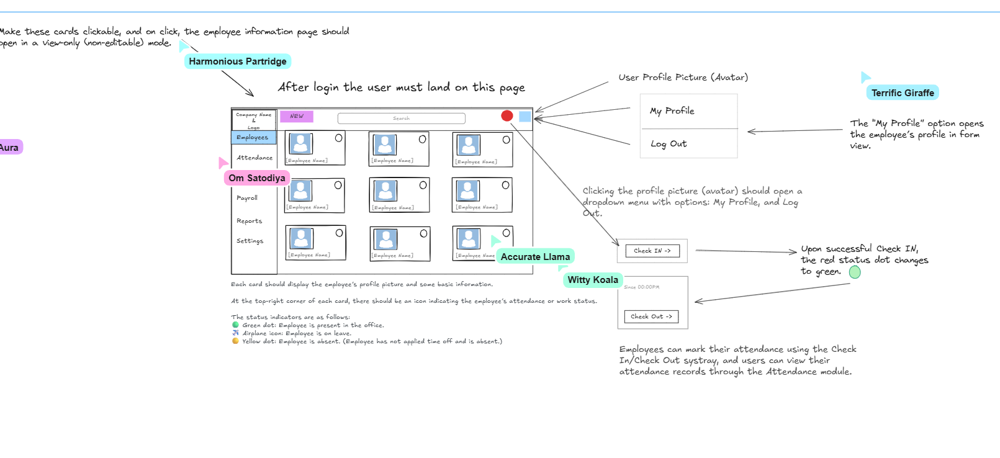
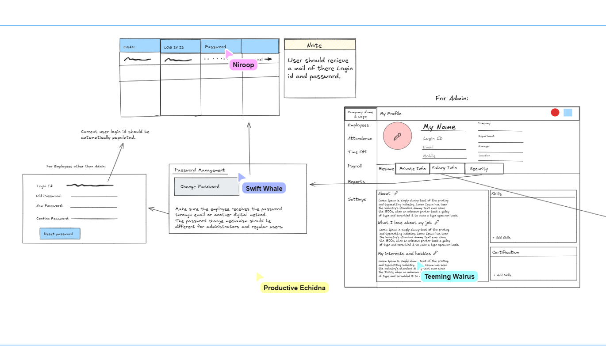
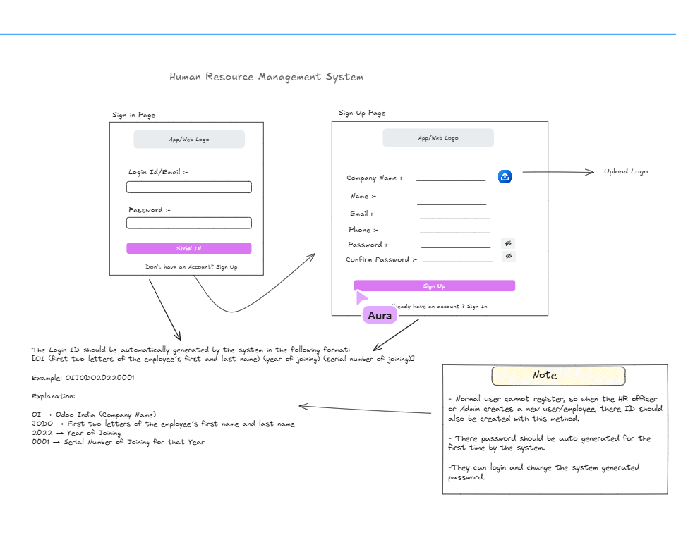
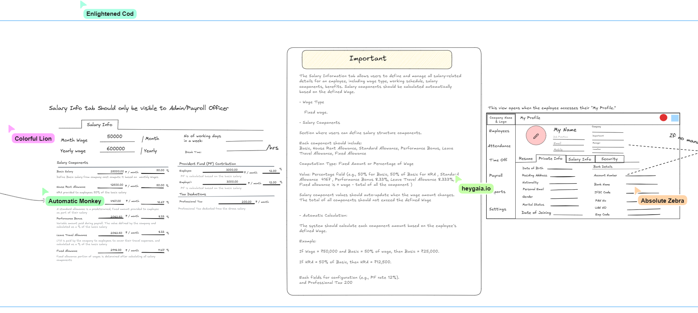

# WorkZen HRMS

## Odoo Hackathon IIT Gandhinagar

### Problem Description

Modern organizations face significant challenges in managing human resources efficiently, particularly in tracking employee attendance, managing leave requests, processing payroll, and maintaining comprehensive employee records. Traditional HR systems are often fragmented, requiring multiple platforms and manual processes that lead to inefficiencies, errors, and poor employee experience. Small to medium enterprises especially struggle with expensive enterprise solutions that are either too complex or lack essential features for streamlined HR operations.

The challenge lies in creating a unified, user-friendly Human Resource Management System that can handle the complete employee lifecycle from onboarding to payroll processing. Organizations need a solution that provides real-time attendance tracking, automated leave management, integrated payroll calculations with tax considerations, and comprehensive reporting capabilities. The system must be accessible, scalable, and provide both employees and HR administrators with intuitive interfaces for their respective workflows.

Furthermore, with the increasing emphasis on digital transformation and remote work capabilities, there is a critical need for an HRMS that supports modern workplace requirements including mobile accessibility, secure authentication, role-based access control, and seamless integration capabilities. The solution should also accommodate different regional requirements such as multi-currency support and local tax regulations like GST calculations for contractor payments.

## Code Stack

### Frontend Technologies
- **React 19** - Modern UI library with latest features
- **Vite** - Fast build tool and development server
- **JavaScript/JSX** - Component-based architecture
- **CSS3** - Custom styling with CSS variables and responsive design

### Backend Technologies
- **Node.js** - Server-side JavaScript runtime
- **Express.js** - Web application framework
- **MongoDB** - NoSQL database for flexible data storage
- **Mongoose** - MongoDB object modeling for Node.js
- **JWT** - JSON Web Tokens for secure authentication
- **bcryptjs** - Password hashing and encryption

### Development Tools
- **Docker** - Containerization for consistent deployment
- **Docker Compose** - Multi-container application management
- **Git** - Version control system
- **VS Code** - Development environment

### Additional Libraries
- **jsPDF** - Client-side PDF generation
- **html2pdf.js** - HTML to PDF conversion
- **CORS** - Cross-Origin Resource Sharing middleware
- **dotenv** - Environment variable management

## File Structure

```
WorkZen-HRMS/
├── backend/
│   ├── controllers/
│   │   ├── authController.js
│   │   ├── employeeController.js
│   │   ├── attendanceController.js
│   │   ├── leaveController.js
│   │   ├── payrollController.js
│   │   ├── userController.js
│   │   └── settingsController.js
│   ├── middleware/
│   │   ├── auth.js
│   │   ├── errorHandler.js
│   │   └── requestLogger.js
│   ├── models/
│   │   ├── User.js
│   │   ├── Employee.js
│   │   ├── Attendance.js
│   │   ├── Leave.js
│   │   ├── Payroll.js
│   │   └── Settings.js
│   ├── routes/
│   │   ├── auth.js
│   │   ├── employees.js
│   │   ├── attendance.js
│   │   ├── leaves.js
│   │   ├── payroll.js
│   │   ├── users.js
│   │   └── settings.js
│   ├── scripts/
│   │   └── seedDatabase.js
│   ├── seed-data/
│   │   └── employees.json
│   ├── app.js
│   ├── server.js
│   ├── healthcheck.js
│   ├── Dockerfile
│   ├── package.json
│   └── .env
├── frontend/
│   ├── public/
│   │   └── index.html
│   ├── src/
│   │   ├── components/
│   │   │   ├── CurrencySelector.jsx
│   │   │   └── PayslipTemplate.jsx
│   │   ├── contexts/
│   │   │   └── AuthContext.jsx
│   │   ├── pages/
│   │   │   ├── Login.jsx
│   │   │   ├── Dashboard.jsx
│   │   │   ├── Employees.jsx
│   │   │   ├── Attendance.jsx
│   │   │   ├── TimeOff.jsx
│   │   │   ├── Payroll.jsx
│   │   │   ├── Reports.jsx
│   │   │   └── Settings.jsx
│   │   ├── styles/
│   │   │   └── main.css
│   │   ├── api/
│   │   │   └── http.js
│   │   ├── App.jsx
│   │   ├── App.css
│   │   ├── index.css
│   │   └── main.jsx
│   ├── Dockerfile
│   ├── package.json
│   ├── vite.config.js
│   └── .env
├── docs/
│   ├── ACCEPTANCE_CRITERIA.md
│   ├── TESTING_CHECKLIST.md
│   ├── DEPLOYMENT_GUIDE.md
│   └── SEED_DATA_PROMPT.md
├── assets/
│   ├── 01.png
│   ├── 02.png
│   ├── 03.png
│   └── 04.png
├── docker-compose.yml
└── README.md
```

## Application Screenshots








### Dashboard Overview


### Employee Management


### Attendance Tracking


### Payroll Processing


## Features

### Core Functionality
- User authentication and role-based access control
- Employee management with comprehensive profiles
- Real-time attendance tracking and management
- Leave request and approval workflow
- Automated payroll calculation and processing
- Professional payslip generation with PDF export
- Multi-currency support (USD, EUR, GBP, INR)
- GST calculation for contractor payments
- Comprehensive reporting and analytics

### Technical Features
- Responsive web design for desktop and mobile
- RESTful API architecture
- JWT-based secure authentication
- Database seeding with realistic test data
- Docker containerization for easy deployment
- Health checks and monitoring
- Error handling and logging
- CORS-enabled cross-origin requests

### User Roles
- **Admin**: Full system access including settings and user management
- **HR Officer**: Employee and attendance management, leave approval
- **Payroll Officer**: Payroll processing and financial reports
- **Employee**: Personal attendance, leave requests, payslip access

## Author

**Om Choksi**  
